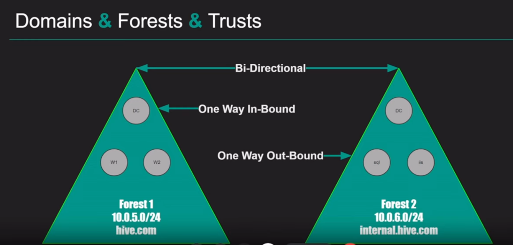
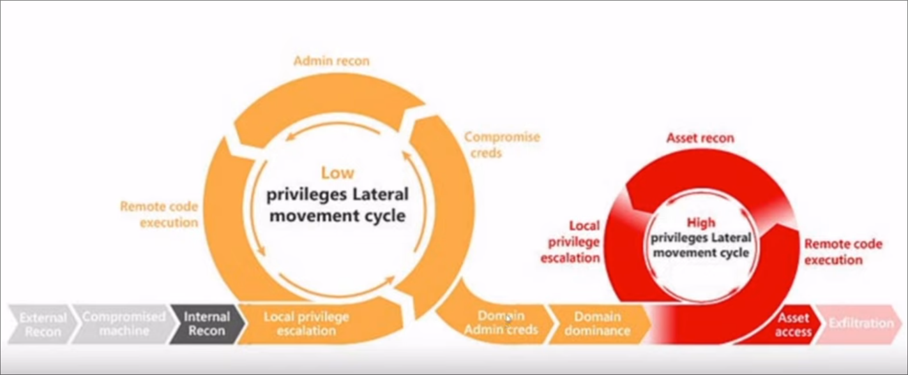

# Intro Active Directory Pentesting

### Source: https://www.youtube.com/watch?v=aFBoi4w68JI

## Beginner Active Directory

- Active Directory (AD) is a directory service created by Microsoft that functions as a centralized database for managing and organizing resources in a network environment. It provides a means to manage and control access to network resources, including *users*, *computers*, *servers*, *printers*, and other network devices.

- Active Directory simplifies administration by providing a centrailized management platform for user authentication, resource access control, and policy enforcement. It enhances security, improves scalability, and streamlines the management of network resources in organizations of all sizes.

## Active Directory Key Components

- **Domain**: A domain is a logical grouping of network resources.

- **Domain Controller (DC)**: A domain controller is a server that runs the Active Directory service and maintains a copy of the AD database.

- **Forest**: A forest is a collection of one or more domain that share a common schema, configuration, and trust relationship.

- **Organizational Units (OUs)**: OUs are containers within a domain that allow administrators to organize and manage resources based on a specific organizational structure.

- **Users and Groups**: Active Directory stores information about users and groups.

- **Group Policies**: Group Policies are settings that define and enforce various configurations on computers and users within the Active Directory environment.

- **Trust Relationships**: Trust relationship establish a level of trust and communication between domains or forests.

- **Replication**: AD employs replication to ensure that changes made to the directory database on one domain controller are synchronized with other domain controllers within the same domain or across different domains.

**Attack Methodology**:

