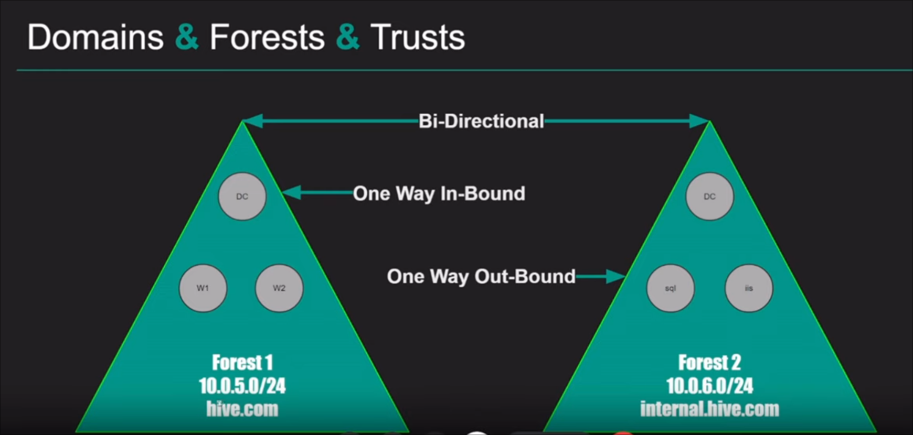
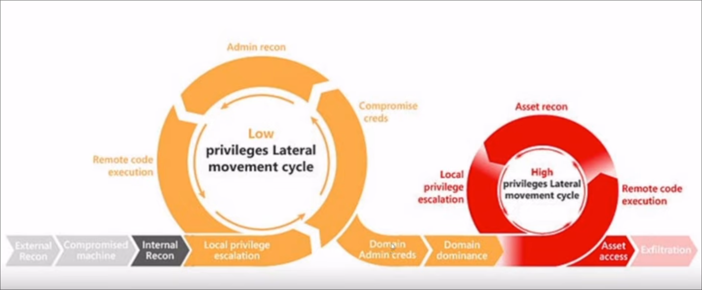

# Intro Active Directory Pentesting

### Source: https://www.youtube.com/watch?v=aFBoi4w68JI

## Beginner Active Directory

- Active Directory (AD) is a directory service created by Microsoft that functions as a centralized database for managing and organizing resources in a network environment. It provides a means to manage and control access to network resources, including *users*, *computers*, *servers*, *printers*, and other network devices.

- Active Directory simplifies administration by providing a centrailized management platform for user authentication, resource access control, and policy enforcement. It enhances security, improves scalability, and streamlines the management of network resources in organizations of all sizes.


## Active Directory Key Components

- **Domain**: A domain is a logical grouping of network resources.

- **Domain Controller (DC)**: A domain controller is a server that runs the Active Directory service and maintains a copy of the AD database.

- **Forest**: A forest is a collection of one or more domain that share a common schema, configuration, and trust relationship.

- **Organizational Units (OUs)**: OUs are containers within a domain that allow administrators to organize and manage resources based on a specific organizational structure.

- **Users and Groups**: Active Directory stores information about users and groups.

- **Group Policies**: Group Policies are settings that define and enforce various configurations on computers and users within the Active Directory environment.

- **Trust Relationships**: Trust relationship establish a level of trust and communication between domains or forests.

- **Replication**: AD employs replication to ensure that changes made to the directory database on one domain controller are synchronized with other domain controllers within the same domain or across different domains.




**Attack Methodology**:



## Enumeration

### Using `crackmapexec` tool for check the Connected Systems:

- basic command to check the connected Systems:

```
crackmapexec smb <network-ip>
```

### Using `nmap` tool for scanning the Network:

- command for scanning the network:

```
nmap -sC -sV -Pn <ip-address> --open
```

- Above Command switches workings:
    - `-sC` enabling script scanning; if the scan find any vulnerability, we will able to see it in the output.
    - `-sV` enabling version detection of the running softwares on the targeted system.
    - `-Pn` skip host discovery
    - `--open` will make the output for only opened ports.

## ADDS Notes

### Source: The Cyber Mentor Youtube: https://www.youtube.com/watch?v=VXxH4n684HE&list=PLK0QqCoBE17DIR_HAiOotqIvFbRLttskN

### What is Active Directory?

- Directory service developed by Microsoft to manage Windows domain networks

- Stores information related to objects, such as Computers, Users, Printers, etc.
    - Think about it as a phone book for Windows

- Authenticates using Kerberos tickets.
    - Non-Windows devices, such as Linux machines, firewalls, etc. can also authenticate to Active Directory via RADIUS or LDAP.

### Why Active Directory?

- Active Directory is the most commonly used identify management service in the world
    - 95% of Fortune 1000 companies implement the service in their networks

- Can be exploited without ever attacking patchable exploits.
    - Instead, we abuse features, trusts, components, and more.

### Physical AD Components

#### Domain Controllers

- A domain controller is a server with the AD DS server role installed thath has specifically been promoted to a domain controller

`Domain Controllers`:

- Host a copy of the AD DS directory store
- Provide authentication and authorization services
- Replicate updates to other domain controllers in the domain and forest
- Allow administrative access to manage user accounts and network resources.

#### AD DS Data store

- The AD DS data sore contains the database files and processes that store and manage directory information for users, services, and applications

`The AD DS data store:`

- Consists of the ntds.dt file
- Is stored by default in the %SystemRoot%\NTDS folder on all domain controllers
- Is accessible only through the domain controller and protocols

> The main dog is `Domain Controller` and grabbing this `ntds.dt` file!

### Logical AD Components

#### AD DS Schema

`The AD DS Schema:`

- Defines every type of object that can be stored in the directory
- Enforces rules regarding object creation and configuration

| Object Types | Function | Examples |
|--------------|----------|----------|
| Class Object | What objects cab be created in the directory | User, Computer |
| Attribute Object | Information that can be attached to an object | Display name |

#### Domains

- Domains are used to group and manage objects in an organization

`Domains: `

- An administrative boundary for applying policies to groups of objects
- A replication boundary for replicating data between domain controllers
- An authentication and authorization boundary that povides a way to limit the scope of access of resources.

#### Trees:


#### Forests:


#### Organizatinals Units (OUs):


#### Trusts:


#### Objects:


### Summing Up the Components:

- We have `Domains` and they are used to group and manage objects in an organization.
- If we have `multiple Domains`, then we have `Tree` and in the structure we could have a `parent Domain` and a `children Domain`
- And then If we have `multiple sets of trees` then we build something called `Forest`.
- Inside these `Domains`, `Trees` or `Forest` there is something which called `Organizational Units (OUs)` which consists of objects (i.e. User, Computers, InetOrgPerson, Contacts, Groups, etc.).
- Cross Forests or Cross Domains we have `Trusts` 
    - and it could be `Directional`: meaning that one domain trust another domain,
    - or it could be `Transitive`: meaning one domain trust another domain and also trust everthing that other domain trust.
