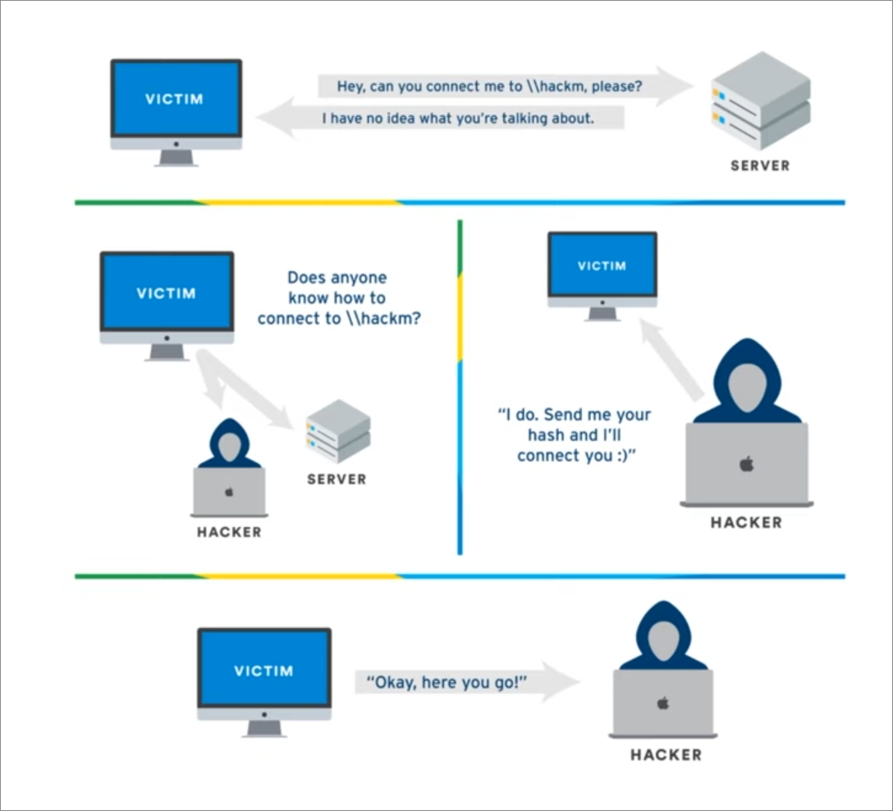

# ADDS Notes

**Source**: The Cyber Mentor Youtube: https://www.youtube.com/watch?v=VXxH4n684HE&list=PLK0QqCoBE17DIR_HAiOotqIvFbRLttskN

## What is Active Directory?

- Directory service developed by Microsoft to manage Windows domain networks

- Stores information related to objects, such as Computers, Users, Printers, etc.
    - Think about it as a phone book for Windows

- Authenticates using Kerberos tickets.
    - Non-Windows devices, such as Linux machines, firewalls, etc. can also authenticate to Active Directory via RADIUS or LDAP.

## Why Active Directory?

- Active Directory is the most commonly used identify management service in the world
    - 95% of Fortune 1000 companies implement the service in their networks

- Can be exploited without ever attacking patchable exploits.
    - Instead, we abuse features, trusts, components, and more.

## Physical AD Components

### Domain Controllers

- A domain controller is a server with the AD DS server role installed thath has specifically been promoted to a domain controller

`Domain Controllers:`

- Host a copy of the AD DS directory store
- Provide authentication and authorization services
- Replicate updates to other domain controllers in the domain and forest
- Allow administrative access to manage user accounts and network resources.

### AD DS Data store

- The AD DS data store contains the database files and processes that store and manage directory information for users, services, and applications

`The AD DS data store:`

- Consists of the ntds.dt file
- Is stored by default in the %SystemRoot%\NTDS folder on all domain controllers
- Is accessible only through the domain controller and protocols

> The main dog is `Domain Controller` and grabbing this `ntds.dt` file!

## Logical AD Components

### AD DS Schema

`The AD DS Schema:`

- Defines every type of object that can be stored in the directory
- Enforces rules regarding object creation and configuration

| Object Types | Function | Examples |
|--------------|----------|----------|
| Class Object | What objects can be created in the directory | User, Computer |
| Attribute Object | Information that can be attached to an object | Display name |

### Domains

- Domains are used to group and manage objects in an organization

`Domains: `

- An administrative boundary for applying policies to groups of objects
- A replication boundary for replicating data between domain controllers
- An authentication and authorization boundary that povides a way to limit the scope of access of resources.

### Trees:


### Forests:


### Organizatinals Units (OUs):


### Trusts:


### Objects:


## Summing Up the Components:

- We have `Domains` and they are used to group and manage objects in an organization.
- If we have `multiple Domains`, then we have a `Tree` and in the structure we could have a `parent Domain` and a `children Domain`
- And then If we have `multiple sets of trees` then we build something called `Forest`.
- Inside these `Domains`, `Trees` or `Forest` there is something which we called `Organizational Units (OUs)` which consists of objects (i.e. User, Computers, InetOrgPerson, Contacts, Groups, etc.).
- Cross Forests or Cross Domains we have `Trusts` 
    - and it could be `Directional`: meaning that one domain trust another domain,
    - or it could be `Transitive`: meaning one domain trust another domain and also trust everthing that other domain trust.

## Setting Up the Domain Controller:

- Rename the Computer, use a custom and memorable name.
- Installing a Domain Controller
    - In the `Server manager` --> `Add Roles and Features`
        - Role based or feature-based installation
        - Server Roles: `Active Directory Domain Services`
        - Then Install it!
        - Promote the server to the Domain Controller.
            -`Deployment Configuration`: Add a new forest (Provide the root domain name).
            - `Domain Controller Options`: Set the Directory Services Restore Mode (DSRM Password) there.
            - `DNS Options`: Ingore the warning for just now and click **Next**.
            - `Additional Options`: Wait the Until you get the NETBIOS domain name to be shown there; then click **Next**.
            - `Paths`: The default paths for **Database Folder**, **Log Files**, and **Sysvol Folder** will be there, click **Next** to continue.
            - `Review Options`: you can click **Next** again to continue!
            - `Installation`: Clicking `Install` will install the stuffs related to ADDS.

## Setting Up the User Machines:

- Create a 2 Windows Client VMs with Good Resources!
- Rename Both Computers to some memorable names.


## Setting Up Users, Group and Policies:

- Select `Tools` --> `Active Directory Users and Computers`.
- Inside the `Active Directory Users and Computer` wizard we have some already Defined OUs.
    - Builtin
    - Computers
    - Domain Controllers
    - ForeignSecurityPrinciples
    - Managed Service Accounts
    - Users

- Right click on the `Domain Controller` and Select `New` --> `Organizational Unit`
    - Rename this as **Group**.
    - Moving all `Security Group` from `Users` OU and move them into newly created `Group` OU. 

> Little Down arrow on the Account icon means that the account has been disabled.

### Creating Domain Users:

- Right click in the blank area of Users OU and select `User`.
- Fill details and set a password.
- Set Password never expired for now.

- Create these users:
    - Create a normal User. - (1)
    - Create a User which is a Copy of Admin - (2)
    - Create a Copy of Normal User again. - (3)
    - Create a Fake SQL account! - (4)

> Service accounts should not be domain adminstrative accounts, but acccording to `The Cyber Mentor` experience he gets usually the Domain Administrative as Service Accounts.

**Setup a File Share**:

- `File and Storage Services` under Server Manager --> `Shares` --> Select `Task` --> `New Share` --> `SMB Share - Quick` --> Next --> Provide the Share Name --> Next in the Rest --> Create.

**Create Service Principle Name**:

- Open `CMD` as `Administrator`.
- type `setspn -a Server01/SQLService.CoolDomain.local:60111 COOLDOMAIN\SQLService`
- For ensuring the settings: `setspn -T CoolDomain.local -Q */*`

**Setting Up the Group Policy**:

- Search `Group Policy` in Windows Start!
- And Open the Management software as `Admin`.
- `Forest` --> `Domain` --> Right-Click `Create a GPO in this domain, and Link it here...`
- Name it as `Disable Windows Defender`
- Right-Click on the `Disable Windows Defender` and select edit!
- `Computer Configurations` --> `Policies` --> `Administrative Templates` --> `Windows Components`--> `Windows Defender Antivirus` --> Selecting `Turn off Windows Defender Antivirus` --> Enable the Setting and apply the changes.

> Make sure that `Enforced` is set to `Yes` under your Disable Windows Defender Group Policy.

### Joining Windows Client Machines to the Domain.

- Create a folder in C Drive and named it as `Share` and share it with `everyone`.
- Open the Network Settings in your Windows Client VM machine and Set the **DNS IP** same as your **Domain Controller IP**.
- Then you can join the Local Domain by simply searching `Domain` in the Windows Start.
- Select Access work or school
- then `Connect` and enter the details of Domain and User that you want to be joined as.
- Then we are going to enable our of the normal user to the local administrator of the current Windows Client machine.
    - Open the `Computer Management` by searching from the start.
    - Goto `Local Users and Groups` options and Select `Groups` there.
    - Double-Click on `Administrators` then `Add` some users.

## Attacking AD, Initial Attack Vectors

> Learning how we can abuse `Features of Windows` and get access to user Accounts also accessing machines as well.

**Cyber Mentor's Starting Article**: https://adam-toscher.medium.com/top-five-ways-i-got-domain-admin-on-your-internal-network-before-lunch-2018-edition-82259ab73aaa

### Link Local Multicast Name Resolution (LLMNR) Poisoning

- Used to identify hosts when DNS fails to do so.
- Previously NBT-NS
- Key flaw is that the services utilize a user's username and NTLMv2 hash when appropriately respondend to.



**Using responder.py**

- Responder is the part of impacket toolkit.
- It responds to the requests. 

**Commands**:

- providing the Network Interface!

```
responder -I eth0 -rdwv
```

- Then goto your Windows Client Machine and in the file explorer address bar try to connect to some location by IP: for example `\\172.16.23.134`

- After that getback to the Machine where your responder is running:

- You'll see some output like this!


- After Getting NetNTLMv2 hash we could easily crack it using **hashcat**.

**command for cracking NetNTLMv2 hash**:

```
hashcat -a 0 -m 5600 hashfile.txt your-wordlist-location
```

- And the output you'll be getting something like this:


### LLMNR Poisoning Mitigation:

- Best defence is to disable LLMNR, not only LLMNR but also NBT-NS (Disable both will make much more sense because if LLMNR fails to respond then it goes to NBT-NS).

- Second Option is to Enable `Network Access Control`. It's checks if the connecting MAC Address is belongs to the network if it does not then it wouldn't allow the system to connect.

### SMB Relay

**What is SMB Relay**?

- Instead of cracking hashes gathered with Responder, we can instead relay those hashed to specific machines and potentially gain access.

**Requirements**

- SMB Signing must be disabled on the target

- Relayed user credentials must be admin on machine

**Modifying responder configuration**:

- Disabling SMB and HTTP responding.
- Then we can Restart the Responder in the same way.

**Setting up relay**:

- It takes the relay and passes it to the target file provided by us, and then we also use `-smb2support` so we can incorporate anything with smb2.


