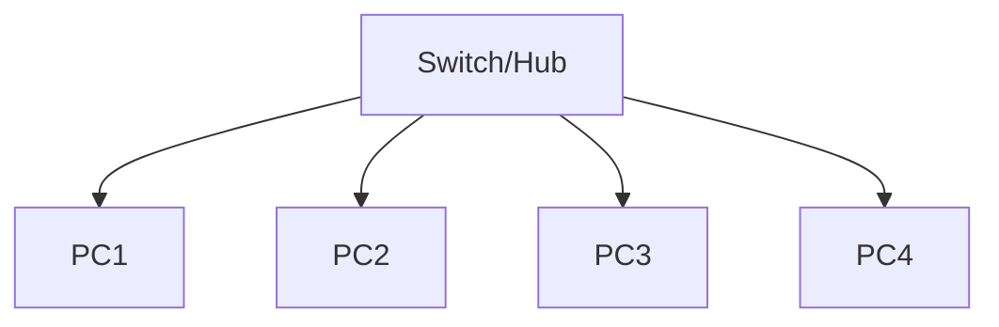
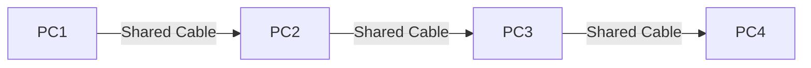
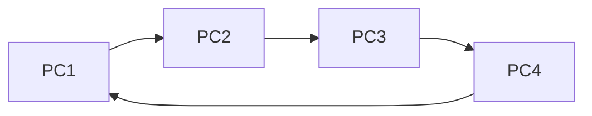
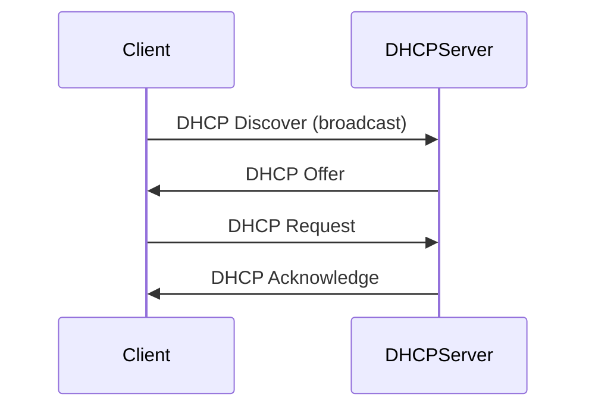

# Comprehensive Network \& Information Security Notes

## Table of Contents

1. [Network Fundamentals](#network-fundamentals)
2. [IP Addressing](#ip-addressing)
3. [Subnetting \& CIDR](#subnetting--cidr)
4. [Network Devices \& Topologies](#network-devices--topologies)
5. [DHCP \& Network Services](#dhcp--network-services)
6. [Operating Systems](#operating-systems)
7. [Windows Server Administration](#windows-server-administration)
8. [Linux Administration](#linux-administration)
9. [Domain \& DNS Concepts](#domain--dns-concepts)

---

## Network Fundamentals

### What is a Network?

A **network** is a collection of interconnected devices that can communicate and share resources.

### Types of Networks

#### 1. PAN (Personal Area Network)

- **Purpose**: Connect personal devices around an individual
- **Device**: Bluetooth, USB, or personal hotspot
- **Range**: Up to 10 meters
- **Devices**: 1-10 devices (smartphones, tablets, laptops, smartwatches)
- **Example**: Connecting your phone to wireless earbuds

#### 2. LAN (Local Area Network)

- **Purpose**: Connect devices within a building or small area
- **Device**: Switch (Layer 2 device)
- **Range**: 4m - 100m
- **Devices**: 2-100+ PCs
- **Example**: Office network, home network

#### 3. CAN (Campus Area Network)

- **Purpose**: Connect multiple buildings within a campus
- **Device**: L3 Switch (operates at Network Layer)
- **Range**: 4m - 1km
- **Devices**: 100-1000+ devices
- **Example**: University campus, corporate campus

#### 4. MAN (Metropolitan Area Network)

- **Purpose**: Connect networks across a metropolitan area
- **Device**: Router (organization-owned)
- **Range**: Up to 50 km
- **Devices**: Multiple locations
- **Example**: City government network, cable TV network

#### 5. WAN (Wide Area Network)

- **Purpose**: Connect networks across large geographical areas
- **Device**: Router (ISP-managed)
- **Range**: 4m - worldwide
- **Devices**: Unlimited locations
- **Example**: Internet, corporate networks across countries

### Wireless Network Types

#### WLAN (Wireless LAN)

- **Device**: Wi-Fi Router
- **Range**: 20m - 50m
- **Use**: Home and small office wireless networks

#### WPAN (Wireless Personal Area Network)

- **Device**: Bluetooth, Zigbee
- **Range**: Up to 10 meters
- **Use**: Short-range connectivity for personal devices

#### WMAN (Wireless MAN)

- **Device**: WiMAX, Wi-Fi CPE (Customer Premises Equipment)
- **Range**: Up to 50 km
- **Use**: Wireless internet service providers

#### WWAN (Wireless WAN)

- **Device**: Cell towers, satellites
- **Range**: 15km - thousands of kilometers
- **Use**: Cellular networks, IoT devices, satellite internet

---

## IP Addressing

### What is an IP Address?

An **IP Address** (Internet Protocol Address) is a unique numerical identifier assigned to every device on a network.

### IP Versions

#### IPv4 (Internet Protocol Version 4)

- **Size**: 32-bit address
- **Structure**: Four octets (8 bits each), separated by dots
- **Format**: X.X.X.X (where X ranges from 0-255)
- **Example**: 192.168.1.100
- **Total Addresses**: 4,294,967,296 (≈4.3 billion)

#### IPv6 (Internet Protocol Version 6)

- **Size**: 128-bit address
- **Structure**: Eight groups of 16 bits, separated by colons
- **Format**: XXXX:XXXX:XXXX:XXXX:XXXX:XXXX:XXXX:XXXX
- **Example**: 2001:0db8:85a3:0000:0000:8a2e:0370:7334

### IPv4 Address Classes

| Class | Range                       | Default Subnet Mask | Example     |
| :---- | :-------------------------- | :------------------ | :---------- |
| A     | 1.0.0.0 – 126.255.255.255   | 255.0.0.0 (/8)      | 10.0.0.1    |
| B     | 128.0.0.0 – 191.255.255.255 | 255.255.0.0 (/16)   | 172.16.0.1  |
| C     | 192.0.0.0 – 223.255.255.255 | 255.255.255.0 (/24) | 192.168.1.1 |
| D     | 224.0.0.0 – 239.255.255.255 | N/A (Multicast)     | 224.0.0.1   |
| E     | 240.0.0.0 – 255.255.255.255 | N/A (Experimental)  | 250.0.0.1   |

### Public vs Private IP Addresses

#### Public IP Addresses

- **Globally unique**, assigned by ISPs, routable on the internet

#### Private IP Addresses

- **Used within private networks**, not routable on the internet
- **Ranges**:
  - 10.0.0.0 to 10.255.255.255
  - 172.16.0.0 to 172.31.255.255
  - 192.168.0.0 to 192.168.255.255
  - 169.254.0.0 to 169.254.255.255 (APIPA)
  - 100.64.0.0 to 100.127.255.255 (Carrier-Grade NAT)

#### Special IP Addresses

- **Loopback**: 127.0.0.1 to 127.255.255.255
- **Broadcast**: Last address in any network (e.g., 192.168.1.255)
- **Network Address**: First address in any network (e.g., 192.168.1.0)

### IANA Hierarchy

```mermaid
graph TD
    A[IANA (Global)] --> B[Regional Registries]
    B --> C[National Registries/ISPs]
    C --> D[End Users]
```

---

## Subnetting \& CIDR

### Subnet Mask

A **subnet mask** determines which portion of an IP address represents the network and which represents the host.

#### Examples

- **Class A**: 255.0.0.0 = /8
- **Class B**: 255.255.0.0 = /16
- **Class C**: 255.255.255.0 = /24

### Subnetting Example

**Original Network**: 192.168.1.0/24 (254 hosts)
**Requirement**: 4 subnets with ~60 hosts each
**Solution**: Use /26 (255.255.255.192)

- **Subnet 1**: 192.168.1.0/26 (192.168.1.1 - 192.168.1.62)
- **Subnet 2**: 192.168.1.64/26 (192.168.1.65 - 192.168.1.126)
- **Subnet 3**: 192.168.1.128/26 (192.168.1.129 - 192.168.1.190)
- **Subnet 4**: 192.168.1.192/26 (192.168.1.193 - 192.168.1.254)

### CIDR (Classless Inter-Domain Routing)

- **Notation**: IP/prefix (e.g., 192.168.1.0/24)

---

## Network Devices \& Topologies

### Network Devices

#### Hub (Legacy)

- **Layer**: Physical (Layer 1)
- **Function**: Simple signal repeater

#### Switch

- **Layer**: Data Link (Layer 2)
- **Function**: Frame switching based on MAC addresses

#### Router

- **Layer**: Network (Layer 3)
- **Function**: Packet routing between different networks

#### Access Point (AP)

- **Function**: Provides wireless connectivity

### Network Topologies

#### Star Topology



#### Bus Topology



#### Ring Topology



#### Mesh Topology

```mermaid
graph TD
    PC1[PC1] -- -- --> PC2[PC2]
    PC1 -- -- --> PC3[PC3]
    PC1 -- -- --> PC4[PC4]
    PC2 -- -- --> PC3
    PC2 -- -- --> PC4
    PC3 -- -- --> PC4
```

---

## DHCP \& Network Services

### DHCP (Dynamic Host Configuration Protocol)

#### DORA Process



---

## Operating Systems

### Linux

- **Created**: 1991 by Linus Torvalds
- **License**: GPL
- **Open Source, Multitasking, Multiuser, Portability, Security, Stability, Performance**

#### Linux Distributions \& Package Managers

- **Debian-based**: .deb, apt, Ubuntu, Mint, Kali
- **Red Hat-based**: .rpm, yum/dnf, Fedora, CentOS, Rocky

### Linux File System Structure

- **/bin**: Essential user commands
- **/sbin**: Admin commands
- **/lib, /lib64**: Libraries
- **/etc**: Config files
- **/dev**: Device files
- **/proc**: Kernel/process info
- **/var**: Variable data
- **/tmp**: Temporary files
- **/usr**: User programs
- **/boot**: Boot loader files
- **/opt**: Optional packages
- **/srv**: Service data
- **/home**: User home directories
- **/root**: Root home
- **/mnt**: Mount points

### Linux Run Levels

- **0**: Halt/Shutdown
- **1**: Single-user mode
- **2**: Multi-user no network
- **3**: Multi-user with network
- **4**: Unused
- **5**: Multi-user with GUI
- **6**: Reboot

---

## Windows Server Administration

### Windows File System Structure

- **C:\\**: Root drive
- **Program Files**: 64-bit apps
- **Program Files (x86)**: 32-bit apps
- **ProgramData**: Shared app data
- **Users**: User profiles
- **Windows**: System files
  - **System32**: Essential files
  - **WinSxS**: Component store
  - **Temp**: Temp files

### Windows Server Roles

- **DHCP Server**
- **DNS Server**
- **File and Storage Services**
- **Active Directory Domain Services**
- **Web Server (IIS)**
- **Print Services**

---

## Domain \& DNS Concepts

### Domain Name System (DNS)

#### DNS Hierarchy

```mermaid
graph TD
    Root[Root Servers (.)]
    Root --> TLD1[.com]
    Root --> TLD2[.org]
    Root --> TLD3[.net]
    TLD1 --> Auth1[example.com]
    TLD2 --> Auth2[example.org]
    TLD3 --> Auth3[example.net]
    Auth1 --> Local1[Local DNS Resolver]
    Auth2 --> Local2[Local DNS Resolver]
    Auth3 --> Local3[Local DNS Resolver]
```

#### DNS Record Types

- **A**: IPv4 address
- **AAAA**: IPv6 address
- **CNAME**: Alias
- **MX**: Mail exchange
- **NS**: Name server
- **PTR**: Reverse lookup
- **TXT**: Text records
- **SRV**: Service locator
- **SOA**: Start of Authority

---

## IP Configuration Rules \& Best Practices

- **Uniqueness**: Each IP must be unique
- **Correct Network**: IP must belong to the segment
- **Valid Range**: Avoid network/broadcast addresses
- **Reserved Addresses**: Don't use gateway/DHCP server IPs
- **Subnet Consistency**: Match subnet mask
- **DHCP Coordination**: Avoid conflicts
- **Gateway Network**: Gateway in same network

---

## Glossary

**APIPA**: Automatic Private IP Addressing (169.254.x.x)
**CIDR**: Classless Inter-Domain Routing
**DHCP**: Dynamic Host Configuration Protocol
**DNS**: Domain Name System
**FQDN**: Fully Qualified Domain Name
**IANA**: Internet Assigned Numbers Authority
**NAT**: Network Address Translation
**OSI**: Open Systems Interconnection
**PoE**: Power over Ethernet
**TCP/IP**: Transmission Control Protocol/Internet Protocol
**VLAN**: Virtual Local Area Network
**VPN**: Virtual Private Network
