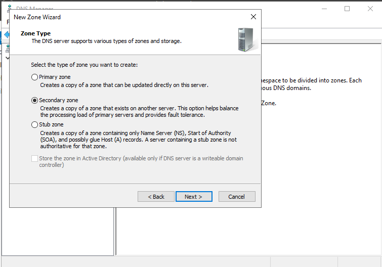
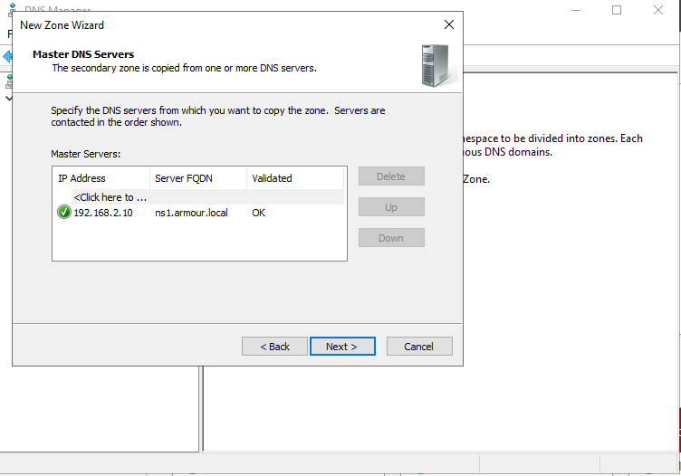
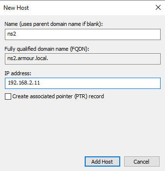
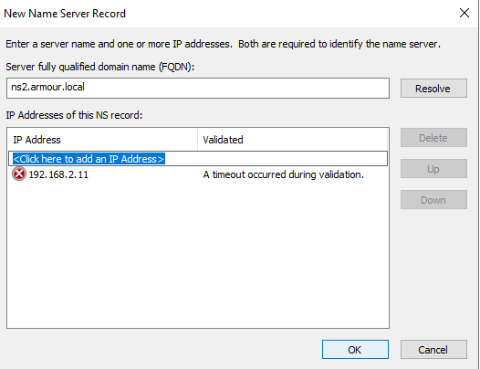
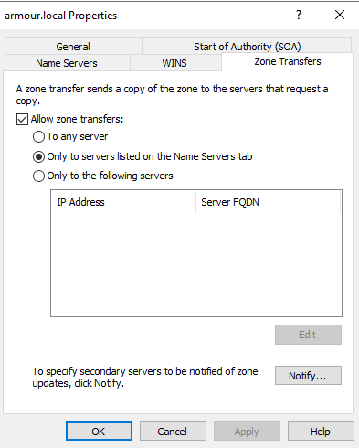
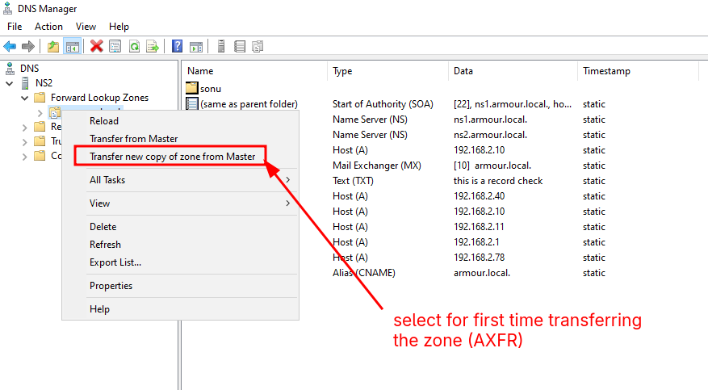
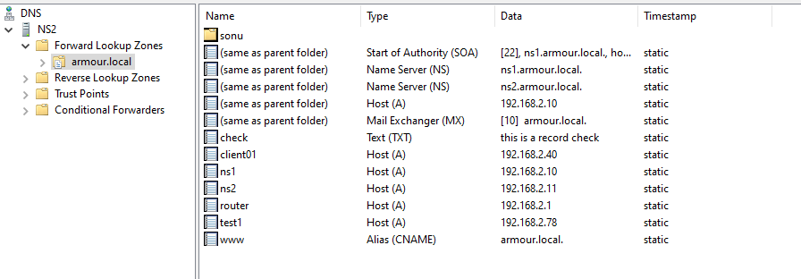
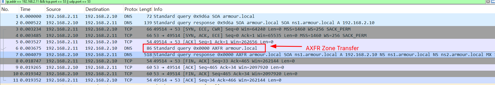
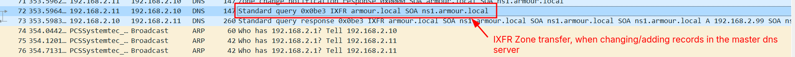

# DNS Server Practical Notes:

## Secondary Server Setup:

**Initial Setup**

- Installing one extra server, besides your primary server:
  - configure the name (i.e. ns2)
  - configure the domain (i.e. armour.local)
  - configure the static IP for the secondary server

**Installing the DNS server**:

- Installing the DNS from the roles and features.

**Configuring the Secondary DNS Server from ns2 server from it's zone**

- setting up the



- setting our master DNS server IP here:
  

- for zone transferring create a A Record in your Primary DNS Server:



- add the IP for zone transfer from your master DNS Server:



- ensure you've this setting in the Zone Transfer Tab:



- for AXFR zone transfer from the master dns server to the secondary dns server.
  

- and after completion of the AXFR zone transferrring, you'll see the records:







**For checking the AXFR Zone Transferring through Wireshark**:

**filter**:

```
ip.addr == 192.168.2.10 && tcp.port == 53 || udp.port == 53
```


