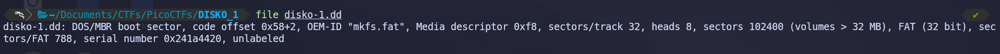

# Notes

## Introduction

- We have a dd file which does contains DOS/MBR boot sector, and it's
- code offset
  `0x58+2` OEM-ID "mkfs.fat",
- Media descriptor `0xf8`, sectors/tract 32, heads 8, sector 102400 (volumes > 32 MB)
- FAT (32 bit)
- sectors/FAT 788,
- serial number 0x241a4420,



### `sudo fdisk -l disko-1.dd` command output:

```
Disk disko-1.dd: 50 MiB, 52428800 bytes, 102400 sectors
Units: sectors of 1 * 512 = 512 bytes
Sector size (logical/physical): 512 bytes / 512 bytes
I/O size (minimum/optimal): 512 bytes / 512 bytes
Disklabel type: dos
Disk identifier: 0x00000000
```

- From the above `fdisk -l` ouput, it's clear that the file doesn't have any
  partition table. Either there partition table is damaged or missing.

### `sudo parted disko-1.dd unit s print` command output:

```
Model:  (file)
Disk /home/billu/Documents/CTFs/PicoCTFs/DISKO_1/disko-1.dd: 102400s
Sector size (logical/physical): 512B/512B
Partition Table: loop
Disk Flags:

Number  Start  End      Size     File system  Flags
 1      0s     102399s  102400s  fat32
```

**Summary Table**:

|                      | Value                                                             |
| -------------------- | ----------------------------------------------------------------- |
| Disk size            | 102,400 sectors x 512 bytes = **52,428,800 bytes** (approx. 50MB) |
| Partition            | One partition (number 1), type FAT32                              |
| Covered              | 0s to 102399s (entire disk)                                       |
| Partition table type | 'loop' (as mapped by Linux)                                       |

- Disk image is a single-partition FAT32 volume, occupying the entire image file,
  intended to be treated as a stand-alone disk for analysis or use.

> `losetup tool`: command in Linux is a tool used to manage loop devices. Loop
> devices are a type of virtual device that allows a regular file to be accessed
> as a block device.

```
sudo losetup -Pf disko-1.dd
```

- This will create a loop device like `/dev/loop0` and(if there are partitions)
  partition devices like `/dev/loop0p1`

- Check which loop device is used:

```
losetup -l
```

**output**:

```
NAME       SIZELIMIT OFFSET AUTOCLEAR RO BACK-FILE                                              DIO LOG-SEC
/dev/loop0         0      0         0  0 /home/billu/Documents/CTFs/PicoCTFs/DISKO_1/disko-1.dd   0     512
```

- Mount the FAT32 partition:

- Use either the `auto` type or explicitly specify `vfat` for FAT32:

```
sudo mount -t vfat /dev/loop0p1 /mnt/disko
```

- 
