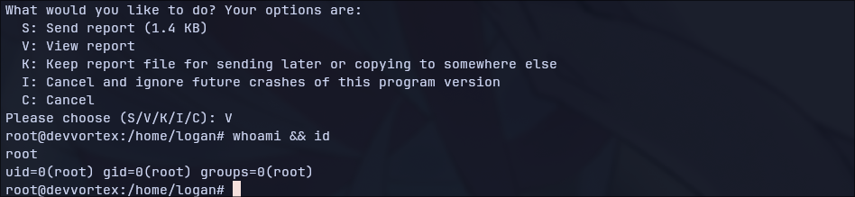

# Devvortex (HTB)
## Difficulty Level: Easy

## Enumeration

### NMAP Scan
```
# Nmap 7.94 scan initiated Sun Nov 26 02:54:39 2023 as: nmap -vvv -p 22,80 -sC -sV -oN tools/nmap/devvortex -vv 10.10.11.242
Nmap scan report for devvortex.htb (10.10.11.242)
Host is up, received syn-ack (0.25s latency).
Scanned at 2023-11-26 02:54:39 IST for 27s

PORT   STATE SERVICE REASON  VERSION
22/tcp open  ssh     syn-ack OpenSSH 8.2p1 Ubuntu 4ubuntu0.9 (Ubuntu Linux; protocol 2.0)
| ssh-hostkey:
|   3072 48:ad:d5:b8:3a:9f:bc:be:f7:e8:20:1e:f6:bf:de:ae (RSA)
| ssh-rsa AAAAB3NzaC1yc2EAAAADAQABAAABgQC82vTuN1hMqiqUfN+Lwih4g8rSJjaMjDQdhfdT8vEQ67urtQIyPszlNtkCDn6MNcBfibD/7Zz4r8lr1iNe/Afk6LJqTt3OWewzS2a1TpCrEbvoileYAl/Feya5PfbZ8mv77+MWEA+kT0pAw1xW9bpkhYCGkJQm9OYdcsEEg1i+kQ/ng3+GaFrGJjxqYaW1LXyXN1f7j9xG2f27rKEZoRO/9HOH9Y+5ru184QQXjW/ir+lEJ7xTwQA5U1GOW1m/AgpHIfI5j9aDfT/r4QMe+au+2yPotnOGBBJBz3ef+fQzj/Cq7OGRR96ZBfJ3i00B/Waw/RI19qd7+ybNXF/gBzptEYXujySQZSu92Dwi23itxJBolE6hpQ2uYVA8VBlF0KXESt3ZJVWSAsU3oguNCXtY7krjqPe6BZRy+lrbeska1bIGPZrqLEgptpKhz14UaOcH9/vpMYFdSKr24aMXvZBDK1GJg50yihZx8I9I367z0my8E89+TnjGFY2QTzxmbmU=
|   256 b7:89:6c:0b:20:ed:49:b2:c1:86:7c:29:92:74:1c:1f (ECDSA)
| ecdsa-sha2-nistp256 AAAAE2VjZHNhLXNoYTItbmlzdHAyNTYAAAAIbmlzdHAyNTYAAABBBH2y17GUe6keBxOcBGNkWsliFwTRwUtQB3NXEhTAFLziGDfCgBV7B9Hp6GQMPGQXqMk7nnveA8vUz0D7ug5n04A=
|   256 18:cd:9d:08:a6:21:a8:b8:b6:f7:9f:8d:40:51:54:fb (ED25519)
|_ssh-ed25519 AAAAC3NzaC1lZDI1NTE5AAAAIKfXa+OM5/utlol5mJajysEsV4zb/L0BJ1lKxMPadPvR
80/tcp open  http    syn-ack nginx 1.18.0 (Ubuntu)
| http-methods:
|_  Supported Methods: GET HEAD
|_http-title: DevVortex
|_http-server-header: nginx/1.18.0 (Ubuntu)
Service Info: OS: Linux; CPE: cpe:/o:linux:linux_kernel

Read data files from: /usr/bin/../share/nmap
Service detection performed. Please report any incorrect results at https://nmap.org/submit/ .
# Nmap done at Sun Nov 26 02:55:06 2023 -- 1 IP address (1 host up) scanned in 27.49 seconds
```

- Website is running on the port 80:


### Directory Searching

- scanning from the ffuf:

```
 http://FUZZ.devvortex.htb

        /'___\  /'___\           /'___\
       /\ \__/ /\ \__/  __  __  /\ \__/
       \ \ ,__\\ \ ,__\/\ \/\ \ \ \ ,__\
        \ \ \_/ \ \ \_/\ \ \_\ \ \ \ \_/
         \ \_\   \ \_\  \ \____/  \ \_\
          \/_/    \/_/   \/___/    \/_/

       v2.1.0
________________________________________________

 :: Method           : GET
 :: URL              : http://FUZZ.devvortex.htb
 :: Wordlist         : FUZZ: /home/casan/HacknTools/wordlists/subdomain/Subdomain.txt
 :: Follow redirects : false
 :: Calibration      : false
 :: Timeout          : 10
 :: Threads          : 40
 :: Matcher          : Response status: 200-299,301,302,307,401,403,405,500
________________________________________________

dev                     [Status: 200, Size: 23221, Words: 5081, Lines: 502, Duration: 2881ms]
```

- we found a subdomain **dev**!


- we directory searching in under the subdomain **dev**, we found:


**Directory scanning on dev.devvortex.htb**

```
301      GET        7l       12w      178c http://dev.devvortex.htb/cache => http://dev.devvortex.htb/cache/
301      GET        7l       12w      178c http://dev.devvortex.htb/language => http://dev.devvortex.htb/language/
301      GET        7l       12w      178c http://dev.devvortex.htb/libraries => http://dev.devvortex.htb/libraries/
301      GET        7l       12w      178c http://dev.devvortex.htb/tmp => http://dev.devvortex.htb/tmp/
301      GET        7l       12w      178c http://dev.devvortex.htb/cli => http://dev.devvortex.htb/cli/
301      GET        7l       12w      178c http://dev.devvortex.htb/plugins => http://dev.devvortex.htb/plugins/
301      GET        7l       12w      178c http://dev.devvortex.htb/api => http://dev.devvortex.htb/api/
301      GET        7l       12w      178c http://dev.devvortex.htb/includes => http://dev.devvortex.htb/includes/
301      GET        7l       12w      178c http://dev.devvortex.htb/administrator => http://dev.devvortex.htb/administrator/
301      GET        7l       12w      178c http://dev.devvortex.htb/components => http://dev.devvortex.htb/components/
301      GET        7l       12w      178c http://dev.devvortex.htb/layouts => http://dev.devvortex.htb/layouts/
301      GET        7l       12w      178c http://dev.devvortex.htb/modules => http://dev.devvortex.htb/modules/
200      GET      339l     2968w    18092c http://dev.devvortex.htb/LICENSE.txt
200      GET       74l      540w     4942c http://dev.devvortex.htb/README.txt
200      GET        8l       11w      170c http://dev.devvortex.htb/libraries/web.config
301      GET        7l       12w      178c http://dev.devvortex.htb/plugins/user => http://dev.devvortex.htb/plugins/user/
301      GET        7l       12w      178c http://dev.devvortex.htb/plugins/user/profile => http://dev.devvortex.htb/plugins/user/profile/
```

- a redirection link to **administrator** page shows this **Joomla Login** page:


- http://dev.devvortex.htb/README.txt relveals that it's running **Joomla version 4.2**

#### Joomla Unauthorized Access Vulnerability (CVE-2023-23752)

**about the vulnerability**: https://nsfocusglobal.com/joomla-unauthorized-access-vulnerability-cve-2023-23752-notice/

- Due to flaws in Joomla's access control to Web service endpoints, unauthenticate attackers access the RestAPI interface to obtain Joomla-related cofiguration information by constructing specially crafted requests, which eventually leads to the disclosure of sensitive information.

**exploit used**: https://github.com/Acceis/exploit-CVE-2023-23752


- Fetched username and password from exploit worked and we get logged-in.

- we can access the template customization settings and we can modify one of the template page to get the reverse shell executed on the target.


- from the above exploit output the information about the database is provided, now we can connect to it!


- and we have the access to the databse, visiting the tables, show that a table named **sd4fg_users** contain detail for the user **logan paul**:


- the hash type is **bcrypt**, let's try cracking it with hashcat using rockyou.txt wordlist.


- the hash got cracked and we got the password for the user **logan**.

**/etc/passwd**:


- this has the username **logan** with /bin/bash shell, we can login to that user!


- **sudo -l** shows that we can run /usr/bin/apport-cli with all privileges.

- in **apport-cli** utility we get the option view the report for application bugs in less mode, which will lead us to a privilege escalation as we are running this through **sudo**:



- We're Root!
