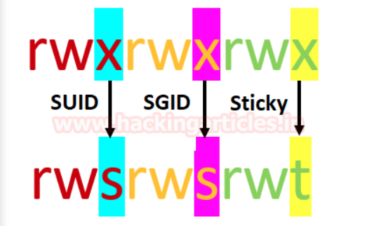
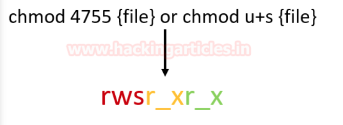

# Hacking Guide

**This guide contains the collection of strategies and ways to get the job done at playing CTF or Doing something tweaky-twisty to get the way around with Information Technology.**

## Privilege Escalation

### Systemctl Status

- **systemctl status** privilege escalation: https://exploit-notes.hdks.org/exploit/linux/privilege-escalation/sudo/sudo-systemctl-privilege-escalation/
- you can put !sh in the less.

## Tools Usages:

### Ffuf

- **for subdomain enumeration**:

👉[**source**](https://medium.com/quiknapp/fuzz-faster-with-ffuf-c18c031fc480)👈
```
ffuf -w subdomains.txt -u http://website.com/ -H “Host: FUZZ.website.com”
```

## Web Application Testing

### Spring Boot Tips:

- Check for the common errors that appeared in Springboot.

- Directory Scanning with spring-boot specific wordlist.

### DOM XSS

👉[**source**](https://www.youtube.com/watch?v=ojiOCfg-FXU)👈

- using portswigger webacademy

- taking place in browser client-side

- searching through scripts, apart from that we have strings

- referencing things with DOM XSS wiki

- testing the script function in console:

```
// i.e.

location.search

//output

'productId=1'

// For checking XSS, alter the Parameter in URL, where it's getting fetched from

'productID=1&test=test'
```

- if the last output comes in the output then the XSS worked!

👉[**source**](https://www.youtube.com/watch?v=_3Wgx1FabIo)👈

### [Linux Privilege Escalation using SUID Binaries](https://www.hackingarticles.in/linux-privilege-escalation-using-suid-binaries/)

#### Permissions in Linux

- the maximum number of bit is used to set permission for each user is **7**, which is a combination of read (**4**) write (**2**) and execute (**1**) operation. For example, if you set chmod 755, then it will look like as **rwxr-xr-x**.

- But when special permission is given to each user it becomes **SUID, SGID, and sticky bits**. When extra bit **"4"** is set to user(Owner) it becomes **SUID** (Set user ID) and when bit "**2**" is set to group it becomes **SGID**(Set Group ID) and if other users are allowed to create or delete any file inside a directory then **sticky bits "1"** is set to that directory.



#### SUID Permission?

- Set User ID is a type of permission that allows user to execute a file with the permission of a specified user.

#### How to set suid?

- You can change the permission of any file either using "Numerical" method or "Symbolic" method.

- As result, it will **replace x from s** as shown in the below image which denotes especial execution permission with the higher privilege to a particular file/command.

- Since we are enabling SUID for Owner (user) therefore **bit 4** and **symbol s** will be added before read/write/execution operation.



- If you execute **ls -al** with the file name and then you observe the small 's' 

## Pentesting RDP Service

#### source: https://book.hacktricks.xyz/network-services-pentesting/pentesting-rdp

- **Remote Desktop** Protocol (RDP) is a proprietary protocol developed by Microsoft, which provides a user with a graphical interface to connect to another computer over a network connection. The user employes **RDP** client software for this purpose, while the other computer must run **RDP** software for this purpose, while other computer must run **RDP** server computer.

**default port**: 3389

```
3389/tcp open  ms-wbt-server     syn-ack Microsoft Terminal Services
```

## Enumeration

**Automatic**:

```
nmap --script "rdp-enum-encryption or rdp-vuln-ms12-020 or rdp-ntlm-info" -p 3389 -T4 <ip-address>
```

`it checks the available encryption and DoS vulnerability(without causing DoS to the service) and obtains NTLM Windows info(versions).`

### LDAP

### DNS Enumeration

- The Domain Name Systems (DNS) is the phonebook of the Internet. Humans access information online throhgh domain names, like nytimes.com or espn.com. Web browsers interact through Internet Protocol (IP) addresses. DNS translates domain names to **IP addresses** so browsers can load Internet resources.

**Default port**: 53

#### Different DNS Servers

1. DNS Root Server: The root servers of the DNS are responsible for the top-level domain donains(TLD). As the last instance, they are only requested if the name server does not respond.
Thus, a root server is a central interface between users and content on the Internet, as it links domain and IP address. The *Internet Corporation for Assigned Names and Numbers*(ICANN) coordinates the work of the root name servers. There are `13` such root servers around the globe.
2. Authoritive Nameserver: Authoritive name servers hold authority
3. Non-authoritive Nameserver:
4. Caching DNS Server:
5. Forwarding Server:
6. Resolver:
