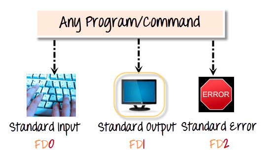

# Input Output Redirection in Linux/Unix

### Source: https://www.guru99.com/linux-redirection.html#:~:text=Redirection%20is%20a%20feature%20in,stdout)%20device%20is%20the%20screen.

## Redirection:

- Redirection is a feature in Linux such that when executing a command, you can change the standard input/output devices. The basic workflow of any **Linux command** is that it takes an input and give an output.

    - The standard input (stdin) device is the keyboard.
    - The standard output (stdout) device is the screen.

### Output Redirection

- symbol **>** is used for output (STDOUT) redirection.

```
> Output Redirection
```

**Example**:

```
ls -all > listings
```

- Here the file "listing" will contain all the output of "ls -all"

- If you want to append the content of some pre-existing file, then use **>>** symbol to do it.

- You can not only redirect the STDOUT to just files but also to devices!

```
cat music.mp3 > /dev/audio
```

- The cat command reads the file music.mp3 and sends the output to /dev/audio which is the audio device. If the sound configurations in your PC are correct, this command will play the file music.mp3.

### Input Redirection

- The '**<**' symbol is used for input(STDIN) redirection.

```
< Input Redirection
```

- Example: The mail program in Linux can help you send emails form the Terminal.

- You can type the contents of the email using the standard device keyboard. But if you want to attach a File to email you can use the input re-direction operator in the following format.

```
Mail -s "Subject" to-address < Filename
```

### File Descriptors (FD)

- In Linux/Unix, everything is a file. Regualar file, Directories, and even Devices are files. Every file has an associated number called File Descriptor (FD).

#### Error Redirection

- Whenever you execute a program/command at the terminal, 3 files are always open, viz., standard input, standard output, standard error.



- These files are always present whenever a program is run. As explained before a file descriptor, is associated with each of these files.

| **File** | **File Descriptor** |
|----------|---------------------|
| **Standard Input STDIN** | **0** |
| **Standard Output STDOUT** | **1** |
| **Standard Error STDERR** | **2** |

- By default, error stream is displayed on the screen. Error redirection is routing the errors to a file other than the screen.

#### Why Error Redirection?

- Error redirection is one of the very popular features of **Unix/Linux**.

- Frequent UNIX users will reckon that many commands give you massive amounts of errors.

    - For instance, while searching for files, one typically gets permission denied errors. These errors usually do not help the person searching for a particular file.
    - While executing shell scripts, you often do NOT want error messages cluttering up the normal program output.

- The solution is to redirect the error messages to a file.

**Example**:

```
myprogram 2>errorsfile
```

- **Example 2**: Server Administrators frequently, list directories and store both error and standard output into a file, which can be processed later. Here is the command.

```
ls Document ABC> dirlist 2>&1
```
Here,
    - which writes the output from one file to the input of another file. 2>&1 means that STDERR redirects to the targets of STDOUT (which is the file dirlist)
    - We are redirecting error output to standard output which in turn is being re-directed to file dirlist. Hence, both the output is written to file dirlist.
