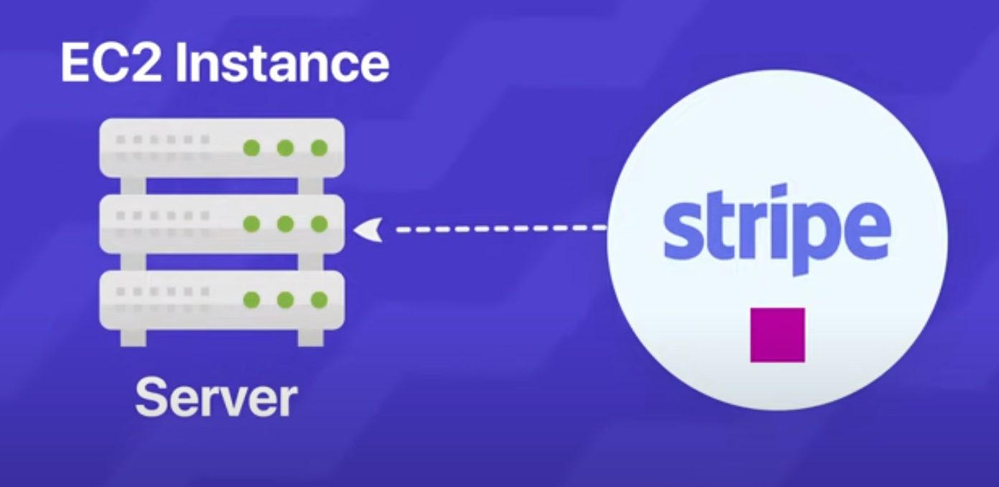
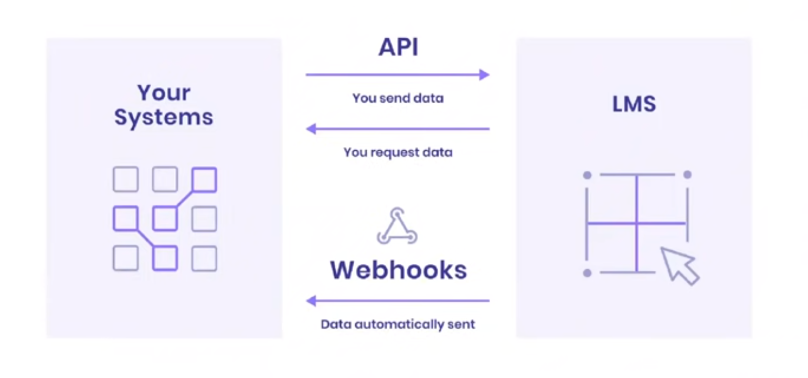

# Terminologies in Networking

1. **Webhooks**:
    - taking stripe and ec2 server instance communication as an example:
    
    - when you buy any subscription on stripe website, on the paymentment when click on pay button and your transanction is successful, stripe send the request to the lambda(graphql backend) with some metadata, and at the backend the metadata get decoded and you get the subscription.
    - Now at the payment page the subscription paying can be cancelled manually (synchronous way of telling backend server that nothing is bought) and it could accidently get closed by closing browser or loosing internet connection (synchronous way of telling backend server that nothing is bought).
    - How Server will know that the request is coming from a stripe not from an attacker; we can validate whether that message is coming from stripe server or not, strip will attach the hash with the message and the server at the backend, and it can verify the the message with the hash which is created by using same the secret key used on stripe.
    - A server calling a server in a secure manner is a webhook.
    
