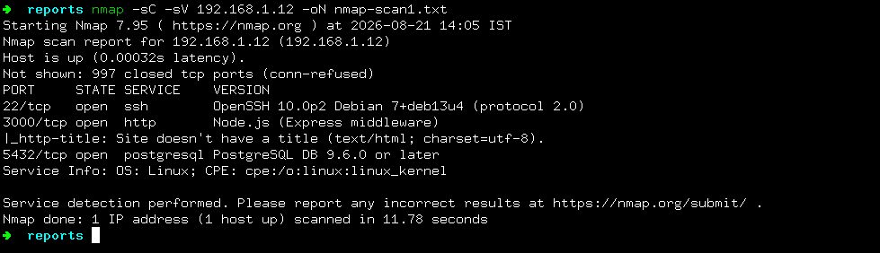
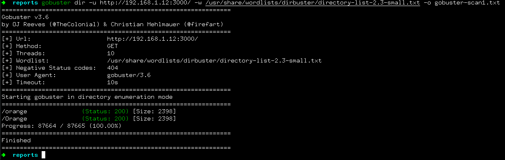
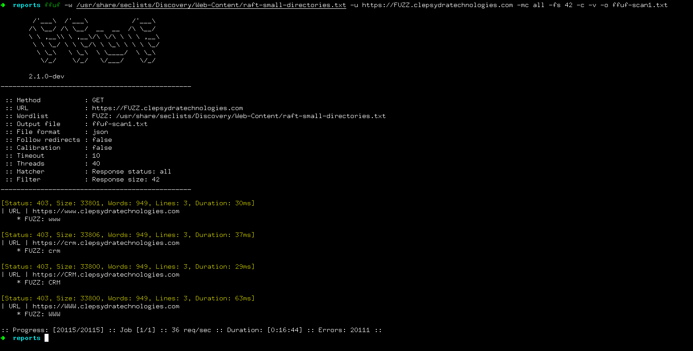

# Recommended Security Testing and Reports for the Development.

**Date: 2026-08-21**

**Source**: self

## Phase 1: Enumeration and Scans

**Network/Individual Host Scan**:

- `nmap`
```
nmap -v -sV -sC <target-ip> -oN scan-output.txt
```

- with actual target testing scenario:
```
nmap -sC -sV 192.168.1.12 -oN nmap-scan1.txt
```



**Directory Scanning**:

- `gobuster`
```
gobuster dir -u https://your-target-site.com -w wordlist.txt -x php,html,js,txt
```

- with actual scenario testing target:
```
gobuster dir -u http://192.168.1.12:3000/ -w /usr/share/wordlists/dirbuster/directory-list-2.3-small.txt -o gobuster-scan1.txt
```



**Subdomain Enumeration**:

- `ffuf`, it is with our website: clepsydratechnologies.com
```
ffuf -w /usr/share/seclists/Discovery/Web-Content/raft-small-directories.txt -u https://FUZZ.clepsydratechnologies.com -mc all -fs 42 -c -v -o ffuf-scan1.txt
```



## Phase 2: Targeted Service Auto-VAPT


## Reporting and Organization:
