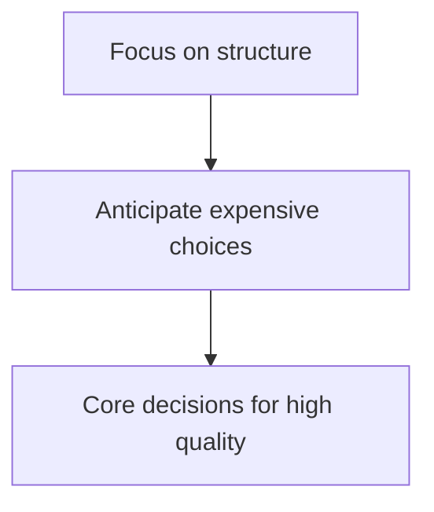
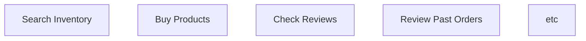
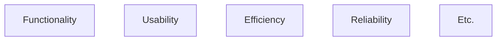
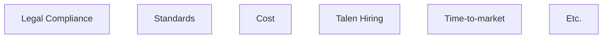
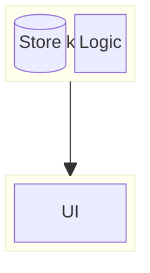

## Getting the Basics: Software Architecture Introduction (part 1):

**source**: https://www.youtube.com/watch?v=8UlLgOf20Ho&list=PL4JxLacgYgqTgS8qQPC17fM-NWMTr5GW6

### What is Software Architecture?

- There many definitions to this like:

  - "Architecture is about the important stuff. Whatever that is." - Ralph Johnson

- For Software Architecture, we usually focus on these things:

#### For Example: We'll create an E-Commerce Website!

1. **Get the Context**:

- What should the system do?
  **Functional Requirement**:

- How should the system Behave?
  **Non-Functional Requirement(a.k.a: ilities)**:

- For example, we are developing our application:

  - for several years (Maintainability Requirement)
  - which is able to serve millions of users (Scalability)
  - which is available 24/7 (Reliability)
  - short response latency (Efficiency)

- **Restrictions**:

- these are the restrictions that'll restrict the no of options to design our system.

- One more example, for e-commerce site we need to comply to the european privacy law (GDPR),
  for that we need to take it into the consideration to architect our app.

2. **Priortize**:

- To design the architecture, it's important to priortize things accordingly, like these
  are cases when developing an application to priortize: - Time to markey Vs Features. - Portability Vs Scalability/Maintainability.

#### Designing the Architecture:

- After priortizing things, start with **One thing at a time**, avoiding **Overengineer**
  problem.
- YAGNI (You Ain't Gonna Need It)

> Good resource for Software Architecture: Software Architecture Patterns: Understanding
> Common Architecture Patterns and When to Use Them

- A Layered Approach Example:

