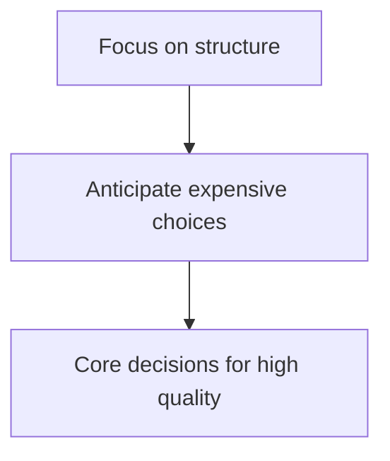

## Getting the Basics: Software Architecture Introduction (part 1):

**source**: https://www.youtube.com/watch?v=8UlLgOf20Ho&list=PL4JxLacgYgqTgS8qQPC17fM-NWMTr5GW6

### What is Software Architecture?

- There many definitions to this like:

  - "Architecture is about the important stuff. Whatever that is." - Ralph Johnson

- For Software Architecture, we usually focus on these things:



#### For Example: We'll create an E-Commerce Website!

1. **Get the Context**:

- What should the system do?

```mermaid
sequenceDiagram
    "Search Inventory"
    "Buy Products"
    "Check Reviews"
    "Review Past Orders"
    "etc"
```
