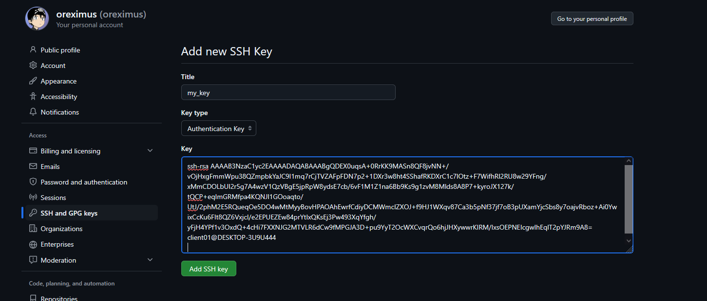
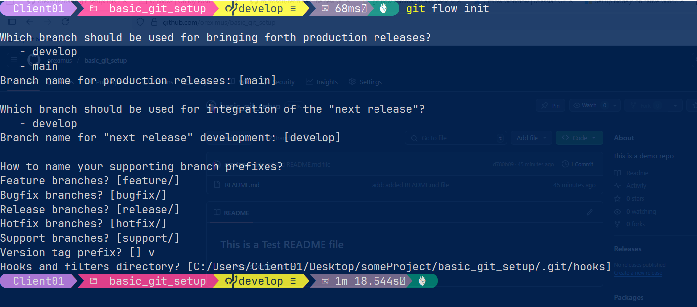
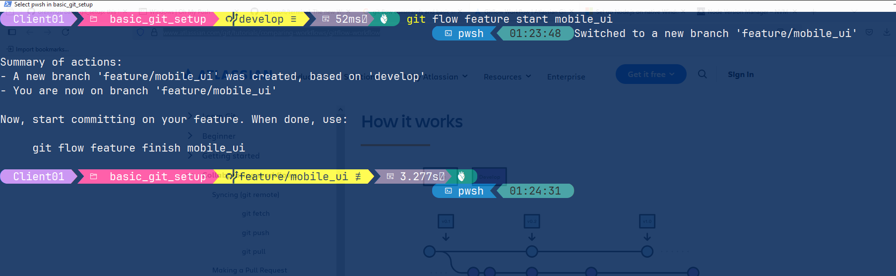

# Development Notes, Basic Setup and Code Templates

## Git Setup with Git Flow:

- for setting up the ssh keys and the public key copying
  in your github account:

- on windows cmd run this command:

```
ssh-keygen
```

- press enter for everything
- open this location (i.e. C:\Users\Client01/.ssh/id_rsa.pub), in
  notepad

```
note C:\Users\Client01/.ssh/id_rsa.pub
```

- paste the ssh public key into your github account settings:
  

## For windows oh-my-posh setting up:

- install the terminal or configure the powershell with nerd fonts!

  - Recommendation: `JetBrainsMono Nerd Font`

- script execution enabling in windows powershell

  - run the powershell as Administrator and run this command:

  ```
  Set-ExecutionPolicy RemoteSigned
  ```

  - Press A to all and then enter

- Add this in your powershell startup profile file:
  - path for your windows powershell profile: C:\Users\<username>\Documents\WindowsPowerShell\Microsoft.PowerShell_profile.ps1

```
oh-my-posh init pwsh --config "$env:POSH_THEMES_PATH\jandedobbeleer.omp.json" | Invoke-Expression
```

## NVM installation in windows

- Download the exe from this link:

```
https://github.com/coreybutler/nvm-windows/releases/tag/1.2.2
```

- example location, for adding it into the path:

```
C:\Users\<UserName>\AppData\Local\nvm
```

-

## Git Flow installation in Windows

- Install the git flow via npm:
  - run the powershell as an administrator:

```
npm i -g git-flow
```

## Setting up the git-flow into an existing github repository

- make sure that you've these two branch, or create them:

```
main
develop
```

## Initializing git flow

- run this command:

```
git flow init
```

- press enter for everything except version prefix, for that provide a value: v.



> for git flow reference: https://www.atlassian.com/git/tutorials/comparing-workflows/gitflow-workflow

- for start working on any new feature:

```
git flow feature start and_your_feature_name
```


