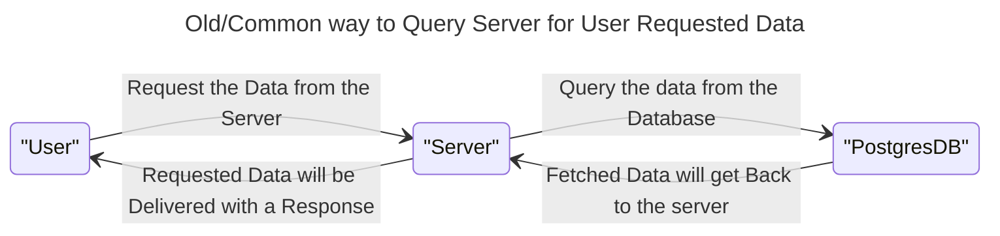
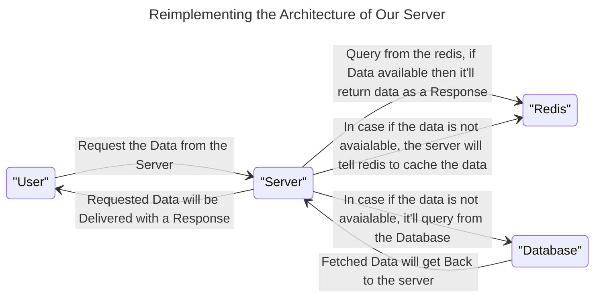

## Redis Crash Course

### Definition of Redis from the Official Wesbite!

- The open-source, in-memory data store used by millions of
developers as a database, cache, streaming engine, and message
broker.

### What is the proble that Redis Solves?

- The above process will take place again entirely if we refresh
the page from the user side, again the data will be requested 
from the server and again the server will query the data from 
the database the return back the data!
    - This leads to these problems:
        1. ReQuery
        2. Increment in response time

- For solving these kind of problems, the Redis like services
comes into play.

- **In-memory** means RAM (primary memory), and the Redis uses
this and we can take advatage of this property through Redis.

- Basic Redis implementation:

