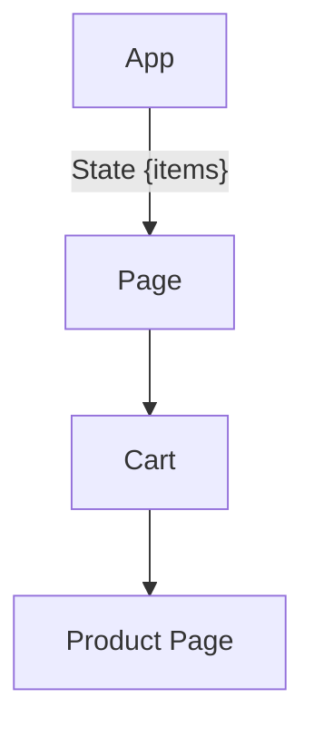
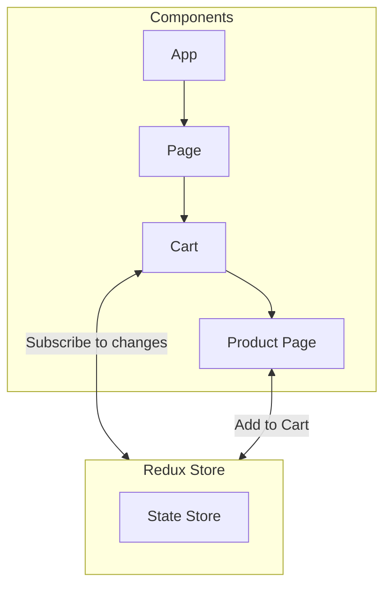
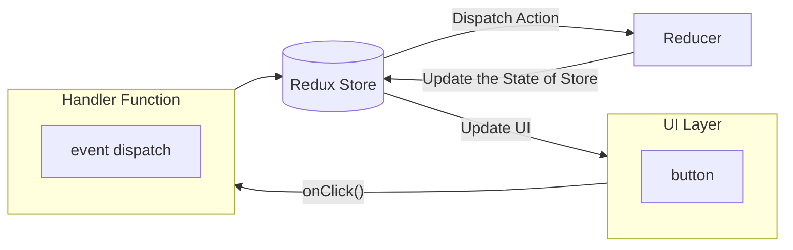

## React Redux Toolkit

**source**: https://www.youtube.com/watch?v=fxT54eRIsc4

- we should when and where we need redux in our project.

- when we have multiple element needs to be stay synced that's where we need redux.

### Component Breakdown

```
function App() {
    const [items, setItems] = useState([]);

    return (
        <div>
            <Cart items={items} />
            <ProductPage onAdd={item => setItems(e => [...e, item])} />
        </div>
    )
}
```

### Prop drilling Scenario



- because the value is transferring through all of the components as you can notice in
  the diagram, so that's case of **Prop Drilling**

- for overcoming this problem we have redux.

### Redux example



- We can create this Redux Store in our project from where we can access all the variables
  throghout the project.

### Redux Architecture

- **UI Layer** --> suppose UI layer has a button (i.e. Add to cart) onClick a handler
  function will run and it'll **dispatch a event** (i.e. Count Increment or anything).

- The event will go to the **Redux Store**, will take that event and then give it to
  the **Reducer Function** (that'll we'll code) which is going to handle our events.



> **React Redux toolkit** and **Redux Toolkit** are two options which are available
> in redux docs, So we need to be careful while using one of those, because the **Redux
> toolkit** is deprecated we should use **React Redux** for better support for the
> development.

### Getting Started with Redux

- we need to install these two things mainly:

```
npm install @reduxjs/toolkit react-redux
```

- now we'll create a directory in **src** directory named as **redux**
  - create a file `store.js` inside this **redux** directory.

```
import { configureStore } from '@reduxjs/tookit'

export const store = configureStore({
    reducer: {},
})
```

- then we'll import the store in our `App.jsx` file and wrapped the whole application
  arround `Provider`

```
import {Provider} from 'react-redux';
import {store} from './redux/store';

// in the Provider give the store as a value
<Provider store={store}>
// your application
</Provider>
```

- now we need to create a `slice`, in redux we denote every feature in the project can
  be a `slice`.

- for example we'll create some feature called `counter`

- inside `/src/redux/slices/counter` a file `index.js`:

```
import { createSlice} from "@redux/tookit"

export const counterSlice = createSlice({
    initialState: 0,
    name: 'counter',
    reducers: {
        increment: (state) => state + 1;
        decrement: (state) => state - 1;
    },
});

export const { increment, decrement } = counterSlice.actions
export default counterSlice.reducer;
```

- In the above code we've just define our `counterSlice` where we've two actions `1. increment`
  `2. decrement` and then at last we've defined `counterSlice.actions` and exported the
  actions and reducers of the `counterSlice`.

- using the `counterSlice` in our project:

- in our `src/redux/store.js` file:

```
// rest is the same
import counterSlice from "./slices/counter";

export const store = configureStore({
    reducer: {
        counter: counterSlice,
    },
});
```

- for accessing the variable value use: `useSelector` hook

```
// example for accessing the state of the redux variable

const count = useSelector((state) => state.counter)
```

- for dispatching an event use: `useDispatch` hook

```
// example for dispatching an event for example we have a button somewhere for
// doing that action

import {increment, decrement} from "./redux/slices/counter"

const dispatch = useDispatch()

<button onClick={()=>dispatch(increment)}>Button</button>
```
