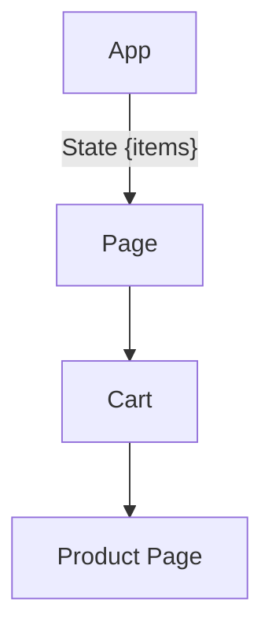
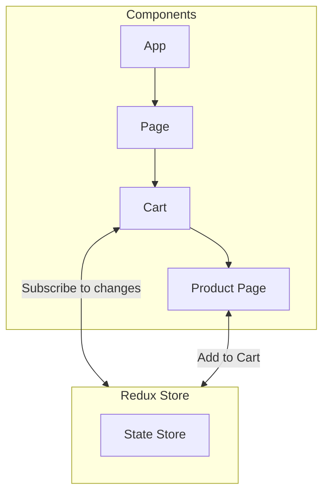
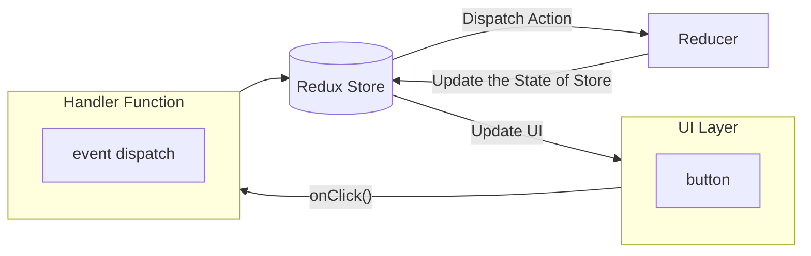

## React Redux Toolkit

**source**: https://www.youtube.com/watch?v=fxT54eRIsc4

- we should when and where we need redux in our project.

- when we have multiple element needs to be stay synced that's where we need redux.

### Component Breakdown

```
function App() {
    const [items, setItems] = useState([]);

    return (
        <div>
            <Cart items={items} />
            <ProductPage onAdd={item => setItems(e => [...e, item])} />
        </div>
    )
}
```

### Prop drilling Scenario



- because the value is transferring through all of the components as you can notice in
  the diagram, so that's case of **Prop Drilling**

- for overcoming this problem we have redux.

### Redux example



- We can create this Redux Store in our project from where we can access all the variables
  throghout the project.

### Redux Architecture

- **UI Layer** --> suppose UI layer has a button (i.e. Add to cart) onClick a handler
  function will run and it'll **dispatch a event** (i.e. Count Increment or anything).

- The event will go to the **Redux Store**, will take that event and then give it to
  the **Reducer Function** (that'll we'll code) which is going to handle our events.



> **React Redux toolkit** and **Redux Toolkit** are two options which are available
> in redux docs, So we need to be careful while using one of those, because the **Redux
> toolkit** is deprecated we should use **React Redux** for better support for the
> development.

### Getting Started with Redux

- we need to install these two things mainly:

```
npm install @reduxjs/toolkit react-redux
```

- now we'll create a directory in **src** directory named as **redux**
  - create a file `store.js` inside this **redux** directory.

```
import { configureStore } from '@reduxjs/tookit'

export const store = configureStore({
    reducer: {},
})
```

-
