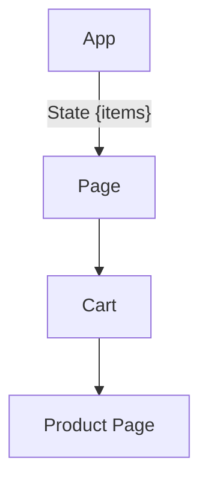
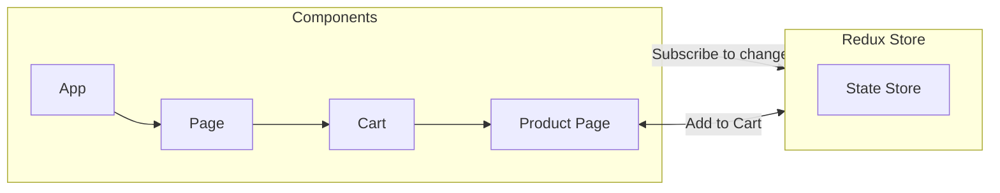

## React Redux Toolkit

**source**: https://www.youtube.com/watch?v=fxT54eRIsc4

- we should when and where we need redux in our project.

- when we have multiple element needs to be stay synced that's where we need redux.

### Component Breakdown

```
function App() {
    const [items, setItems] = useState([]);

    return (
        <div>
            <Cart items={items} />
            <ProductPage onAdd={item => setItems(e => [...e, item])} />
        </div>
    )
}
```

### Prop drilling Scenario



- because the value is transferring through all of the components as you can notice in
  the diagram, so that's case of **Prop Drilling**

- for overcoming this problem we have redux.

### Redux example


